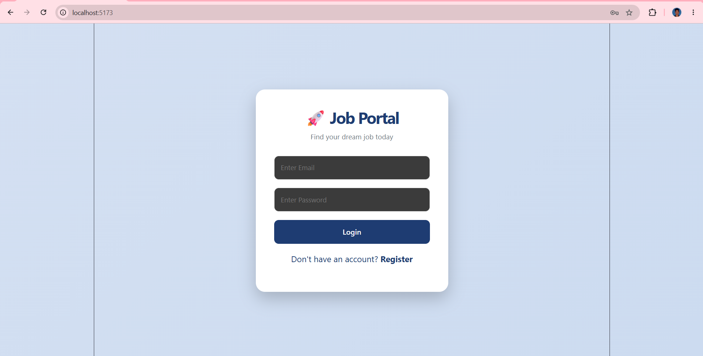
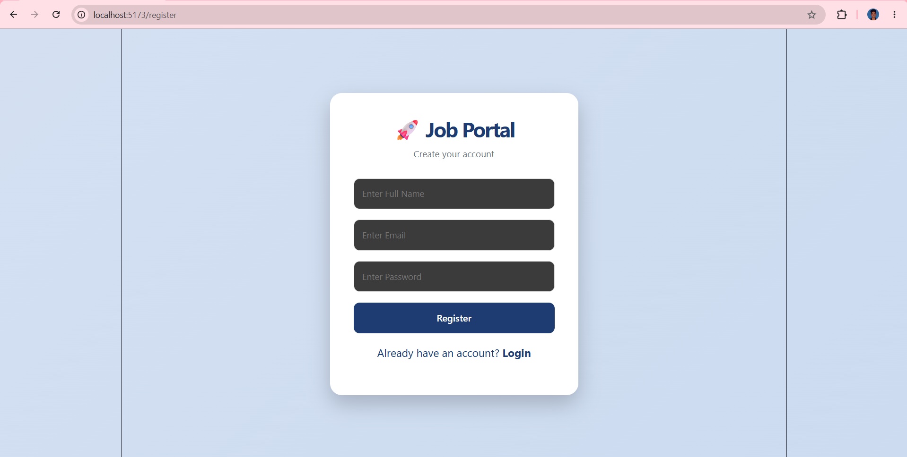
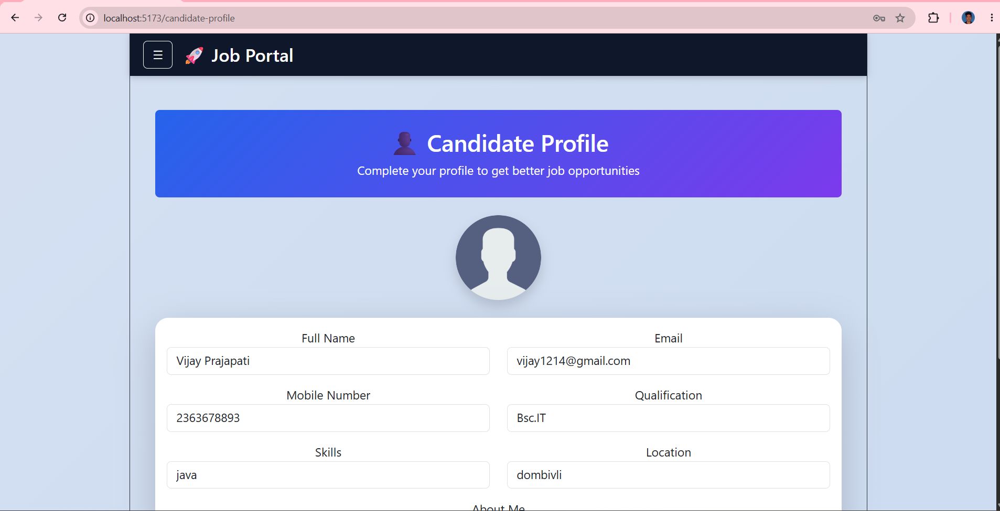
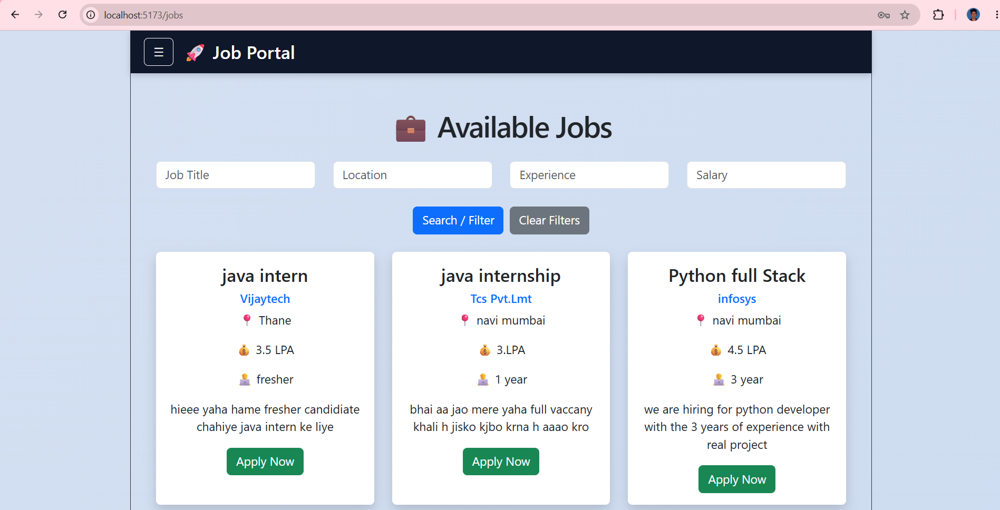
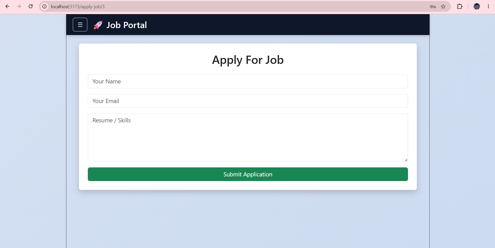

<div align="center">

# 🚀 Job Portal Management System

### Full Stack Job Portal built with React.js, Spring Boot, MySQL & JWT Authentication

</div>

---

## 📖 Overview

Job Portal Management System is a Full Stack web application that connects job seekers and recruiters on a single platform.

Candidates can search and apply for jobs, while recruiters can post jobs, manage applications, and track candidate status.

---

## ✨ Key Features

### 👨‍💼 Candidate Module

* User Registration & Login
* JWT Authentication
* Candidate Dashboard
* Profile Management
* Search Jobs
* Apply for Jobs
* Track Application Status

### 🏢 Recruiter Module

* Recruiter Login
* Post New Jobs
* Manage Jobs
* View Applications
* Update Application Status
* Dashboard Management

---

## 🛠️ Tech Stack

| Technology      | Used               |
| --------------- | ------------------ |
| Frontend        | React.js           |
| Styling         | Bootstrap          |
| Backend         | Spring Boot        |
| Security        | JWT Authentication |
| Database        | MySQL              |
| ORM             | Spring Data JPA    |
| API Testing     | Postman            |
| Version Control | Git & GitHub       |

---

## 📸 Project Screenshots

### 🔐 Login Page



### 📝 Register Page



### 📊 Candidate Dashboard


### 👤 Profile Management



### 💼 Available Jobs



### 📨 Apply For Job



### 📋 My Applications


### ⚙️ Admin Dashboard


### 📑 Job Applications


---

## 🎥 Project Demo

Demo video available inside:

```text
Video/JobportalDemo.mp4
```

---

## 📂 Project Structure

```text
Job-Portal-Management-System
│
├── frontend
├── backend
├── Screenshots
└── Video
```

---

## 🚀 Run Locally

### Frontend

```bash
cd frontend
npm install
npm run dev
```

### Backend

```bash
cd backend
mvn spring-boot:run
```

---

## 🔐 Security Features

* JWT Token Authentication
* Role Based Access Control
* Secure REST APIs
* Protected Routes

---

## 🌟 Project Highlights

✔ Full Stack Development

✔ JWT Security

✔ REST APIs

✔ Role Based Access

✔ MySQL Integration

✔ Responsive User Interface

✔ Real World Project

---

## 👨‍💻 Developer

### Vijay Prajapati

B.Sc IT Graduate

Java Full Stack Developer

GitHub:
https://github.com/vijaymp1214

---

⭐ If you like this project, don't forget to star the repository.
